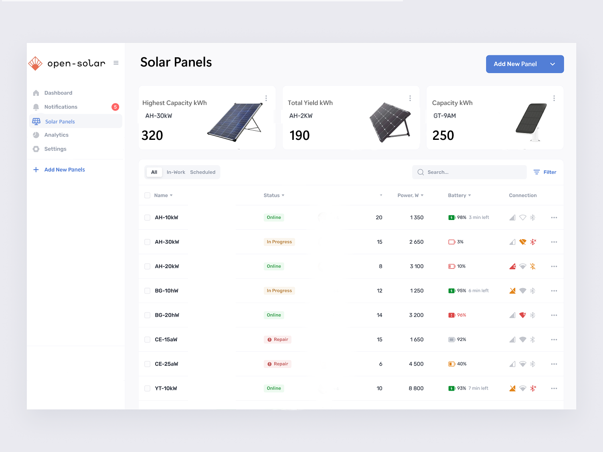

<p align="center">
  
</p>
<p align="center">
  <i>A collaborative, knowledge managment system for your sonal panels built using React and Node.js.</i>
  <br/>
  
</p>
<p align="center">
  <a href="https://circleci.com/gh/outline/outline" rel="nofollow"></a>
  <a href="http://www.typescriptlang.org" rel="nofollow"></a>
  <a href="https://github.com/prettier/prettier"></a>
  <a href="https://github.com/styled-components/styled-components"></a>
  <a href="https://translate.getoutline.com/project/outline" alt="Localized"></a>
</p>


## Contributing

Outline is built and maintained by a small team – we'd love your help to fix bugs and add features!

Before submitting a pull request _please_ discuss with the core team by creating or commenting in an issue – we'd also love to hear from you in thediscussions. This way we can ensure that an approach is agreed on before code is written. 

## Tests

We aim to have sufficient test coverage for critical parts of the application and aren't aiming for 100% unit test coverage. All API endpoints and anything authentication related should be thoroughly tested.

```shell
# To run all tests
make test

# To run backend tests in watch mode
make watch
```

Once the test database is created with `make test` you may individually run
frontend and backend tests directly.

```shell
# To run backend tests
yarn test:server

# To run a specific backend test
yarn test:server myTestFile

# To run frontend tests
yarn test:app
```


# Getting Started with open-solar

This project was bootstrapped with [Create React App](https://github.com/facebook/create-react-app).

## Available Scripts

In the project directory, you can run:

### `npm start`

Runs the app in the development mode.\
Open [http://localhost:3000](http://localhost:3000) to view it in your browser.

The page will reload when you make changes.\
You may also see any lint errors in the console.

### `npm test`

Launches the test runner in the interactive watch mode.\
See the section about [running tests](https://facebook.github.io/create-react-app/docs/running-tests) for more information.

### `npm run build`

Builds the app for production to the `build` folder.\
It correctly bundles React in production mode and optimizes the build for the best performance.

The build is minified and the filenames include the hashes.\
Your app is ready to be deployed!

See the section about [deployment](https://facebook.github.io/create-react-app/docs/deployment) for more information.

### `npm run eject`

**Note: this is a one-way operation. Once you `eject`, you can't go back!**

If you aren't satisfied with the build tool and configuration choices, you can `eject` at any time. This command will remove the single build dependency from your project.

Instead, it will copy all the configuration files and the transitive dependencies (webpack, Babel, ESLint, etc) right into your project so you have full control over them. All of the commands except `eject` will still work, but they will point to the copied scripts so you can tweak them. At this point you're on your own.

You don't have to ever use `eject`. The curated feature set is suitable for small and middle deployments, and you shouldn't feel obligated to use this feature. However we understand that this tool wouldn't be useful if you couldn't customize it when you are ready for it.


